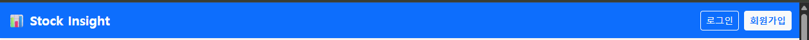

# 프로젝트 보고서 05: 개인별 관심 종목 관리

## **1. 프로젝트 목표**

본 프로젝트는 직전 단계(관심 종목 토론 데이터 수집 프로젝트)를 확장하여, **회원 기능과 사용자별 관심 종목 관리 기능**을 구현하는 것을 목표로 하였다.
 Django의 인증 시스템을 기반으로 회원가입, 로그인/로그아웃을 제공하고, 사용자별로 관심 종목을 저장·조회·삭제할 수 있는 기능을 구현하였다.
 또한, 관심 종목 클릭 시 기존의 **크롤링 기능**과 연동하여 댓글 데이터를 확인할 수 있도록 설계하였다 .

---

## **2. 준비 사항**

- 개발 언어 및 프레임워크: **Python, Django**
- UI 프레임워크: **Bootstrap 5**
- 개발 환경: Visual Studio Code, Git
- DB: SQLite (Django 기본 설정)

---

## **3. 작업 순서**

1. 직전 프로젝트(04_pjt) 코드를 기반으로 회원 기능 및 관심 종목 관리 기능을 확장
2. Django `auth` 시스템 분석 및 적용 (User 모델, 로그인/로그아웃 뷰)
3. 관심 종목 관리 모델(`WatchItem`) 설계 및 마이그레이션
4. 회원가입/로그인/로그아웃/관심 종목 관리/댓글 크롤링 기능 구현
5. Bootstrap을 활용하여 UI/UX 개선
6. Git에 소스코드와 결과물 정리 후 업로드

---

## **4. 요구사항 구현 현황**

### **A. 네비게이션 바 (F01)**

- 로그인 상태에 따라 메뉴가 다르게 표시되도록 구현
    - 비로그인: 회원가입, 로그인 메뉴
      
        
        
    - 로그인: 로그아웃, 프로필 페이지(관심 종목 관리)
      
        
    
- 공통 기능으로 주식 댓글 분석 페이지 접근 가능
  
    
    
    `Stock Insight` 클릭!
    

### **B. 회원가입 구현 (F02)**

- Django 기본 User 모델 기반
  
    
    
- 입력 필드: `username`, `password1`, `password2`
- 회원가입 성공 시 **자동 로그인 처리** 및 메인 페이지 이동 완료
  
    
    

### **C. 로그인/로그아웃 구현 (F03)**

- Django `auth` 모듈 활용
- 로그인 성공 시 사용자 이름 표시
  
    
    
- 로그아웃은 POST 요청 기반 버튼으로 구현, 성공 시 로그인/회원가입 버튼 표시
  
    
    

### **D. 관심 종목 저장 모델 구현 (F04)**

- `WatchItem` 모델 설계
    - 외래키(ForeignKey)로 User와 연결
    - 종목명, 종목코드, 생성일자 포함
- 동일 사용자가 동일 종목을 중복 저장하지 못하도록 **UniqueConstraint 적용**
  
    
    

### **E. 프로필 페이지 – 관심 종목 관리 (F05)**

- 관심 종목 추가/조회/삭제 기능 구현
- 저장된 종목이 없을 경우 안내 메시지 출력
- 각 종목명 옆에 삭제 버튼 배치, 클릭 시 DB에서 제거 후 갱신
  
    
    

### **F. 관심 종목 클릭 시 크롤링 (F06)**

- 관심 종목 리스트에서 종목명을 클릭하면 댓글 분석 페이지로 이동
  
    
    
    
    
- 데이터 출력 규칙:
    - DB에 해당 종목 댓글이 있으면 DB 데이터 출력
    - 없을 경우 크롤링 수행 후 DB에 저장하고 출력

### **G. UI/UX 개선 (F07, 심화)**

- Bootstrap 5를 적용하여 네비게이션, 카드형 로그인/회원가입 페이지, 프로필 페이지 레이아웃 개선
- 메시지 시스템을 Bootstrap Alert 컴포넌트로 통일하여 사용자 경험 향상

---

## **5. 비기능적 요구사항**

- **문서화(NF01)**: 본 README를 통해 프로젝트 분석, 구현 과정, 학습 내용을 정리
- **Git 관리(NF02)**: `.gitignore`를 설정하여 가상환경 및 환경변수 관리

---

## **6. 학습 내용 및 어려움**

- Django 인증 시스템의 구조를 이해하고, `LoginView`, `LogoutView`, `UserCreationForm`을 커스터마이징하여 활용할 수 있었다.
- 로그아웃이 GET 요청에서 405 오류가 발생하는 이슈를 경험하였고, POST 방식으로 해결하였다.
- 관심 종목 모델 설계 시 `unique_together`와 `ForeignKey`를 적절히 적용하여 중복 저장을 방지하였다.
- Bootstrap을 통해 UI를 개선하면서, 서비스 완성도와 사용자 경험을 동시에 고려하는 방법을 익혔다.

---

## **7. 결과**

최종 산출물:

1. Django 프로젝트 소스코드 및 앱 전체 구현
2. 실행 결과 화면 캡처 (회원가입, 로그인/로그아웃, 관심 종목 관리, 댓글 조회)
3. README.md (본 문서)

---

## **8. 결론**

본 프로젝트를 통해 단순 데이터 수집에서 한 단계 나아가, **사용자 인증과 데이터 관리, UI/UX 개선**을 포함한 웹 서비스의 핵심 요소를 직접 경험하였다.
 특히, 회원 기능과 관심 종목 관리, 크롤링 연동까지 구현하여 명세서의 모든 필수 기능을 충실히 완성하였음을 확인할 수 있다.
