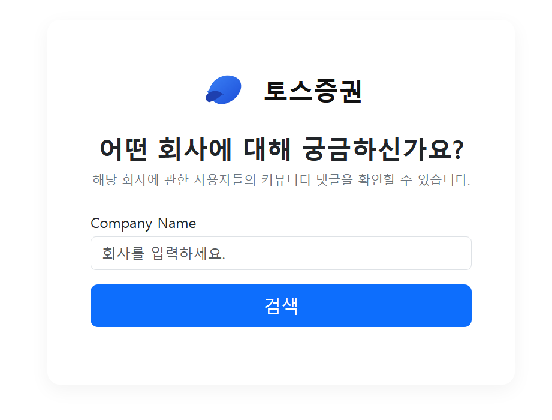

# PJT

# 04_pjt — 관심 종목 토론 데이터 수집/분석

작성일: 2025-09-26

---

## 1. 목표 및 개요

본 프로젝트는 **관심 종목의 토론 댓글을 자동으로 수집**하고 **웹 애플리케이션에서 출력·삭제**할 수 있도록 구축하였으며, 심화로 **OpenAI API 기반 감성분석**과 **로고 마스크 워드클라우드** 시각화를 제공한다. 기능명세서의 필수/심화 요구사항을 기준으로 설계와 구현을 완료하였다. 

---

## 2. 준비사항 (개발환경 / 도구)

- requirements.txt 로 가상환경을 표준화하였다.

---

## 3. 작업 순서 (프로세스)

1. 기능명세서 분석 및 필수/심화 요구사항 정리
2. 역할 분담(개발/테스트/문서) 및 구현 범위 확정
3. Django 앱 구조 설계 및 크롤러(Selenium) 구현
4. DB 모델 작성 → 저장/조회/삭제 흐름 연결
5. 심화: OpenAI API 감성분석 및 워드클라우드 추가
6. 소스/산출물 정리, README/문서화, Git 업로드 

---

## 4. 기능명세서 기준 구현 내역

### A. 종목 입력 화면 (요구사항 F01 — 필수)



- 경로: `/crawlings/index/`
- 회사명(종목명) 입력 폼과 검색 버튼 제공
- 제출 시 서버로 종목명이 전달되어 다음 단계(크롤링)로 진행
    
    **결과:** 사용자 입력 흐름과 UI를 구성하여 명세 충족. 
    

### B. 종목 데이터 크롤링 (요구사항 F02 — 필수)

- Selenium으로 토스증권 접속 → 검색 → 최상단 종목 선택 → 커뮤니티 탭 댓글 수집
- 수집 데이터: `회사명`, `종목코드(현재 로직에서는 공란 가능)`, `댓글내용`, `저장일시`
- DB 저장: `Comment` 모델에 `bulk_create(ignore_conflicts=True)` 사용으로 성능과 중복 대비
    
    **결과:** 사용자 입력 종목에 대해 실제 댓글이 DB에 저장되도록 구현. 
    

### C. 크롤링 데이터 출력 (요구사항 F03 — 필수)


- 경로(예시): `/crawlings/comments/`
- 쿼리 파라미터 `?name=삼성전자`로 종목 필터 출력, 없으면 전체 출력
- 템플릿에 리스트 형태로 직관적 배치, 회사명 및 (가능 시) 종목코드 표시
    
    **결과:** 명세의 목록 출력 요구 충족. 
    

### D. 댓글 삭제 (요구사항 F04 — 필수)


- 각 댓글 우측에 삭제 버튼 제공
- 버튼 클릭 시 해당 레코드 삭제 후 동일 화면으로 반영(redirect)
    
    **결과:** 단건 삭제 흐름 구현 및 즉시 반영. 
    

### E. OpenAI API 활용 종목 분석 (요구사항 F05 — 심화)

- `SA.py` 모듈: `analyze_sentiments(texts, max_items, strategy)` 제공
    - **비용 절감:** 상단 **N개만** API로 전달(기본 60개), `?sa=` 파라미터로 조정
    - 실패 시 중립으로 폴백하여 서비스 안정성 확보
- `views.py`의 **printing** 단계에서 감성분석 호출 →
    
    
    
    요약(긍·중·부 비율), 각 댓글의 라벨/점수 배지 표시
    
- 로고 마스크 **워드클라우드**(토스 로고 형태) 생성/출력
    
    
    
- 마스크는 **흑백(검정=채움, 흰색=비움)** 기준으로 이진화하여 형태 재현
- 한글 폰트(`Paperlogy-8ExtraBold.ttf`)를 정적 폴더에 배치하여 가독성 확보
    
    **결과:** 심화 요구사항(분석/결과 출력) 충실 구현. 
    

---

## 5. 비기능 요구사항 이행

- **NF01 문서화:** 본 문서(README + 제출용 보고서)를 포함하여 구현 과정/학습 내용을 서술
- **NF02 Git 관리:** 프로젝트와 산출물을 정리하여 Git 업로드 (프로젝트명: `04_pjt`)
- **NF03 유지보수:** `.gitignore` 적용으로 불필요/민감 파일(예: `.env`, `.pem`) 제외
    
    **결과:** 비기능 요구 충족 및 제출 요건 정리. 
    

---

## 6. 시스템/아키텍처 개요

- **프론트(템플릿):** `index.html`(입력), `comments.html`(출력/삭제/시각화)
- **백엔드(Views):**
    - `crawling`: Selenium 크롤링 → DB 저장 (요청 종목 기준)
    - `printing`: DB 조회 → **감성분석 호출** → **워드클라우드 생성** → 렌더
    - `delete`: 단건 삭제 처리
- **서비스 흐름:** `index → crawling → redirect(printing)`
- **외부 연동:** Selenium(크롤링), OpenAI API(감성분석)

---

## 7. 데이터 모델

```python
class Comment(models.Model):
    company_name = models.CharField(max_length=100)
    stock_code   = models.CharField(max_length=20, blank=True)  # 현재 미수집 허용
    text         = models.TextField()
    created_at   = models.DateTimeField(auto_now_add=True)      # 저장일시

```

> 실제 필드명/타입은 팀 컨벤션에 따라 약간의 차이가 있을 수 있다(핵심은 회사명/코드/댓글/일시 저장).
> 

---

## 8. 주요 구현 상세

### 8.1 Selenium 크롤링 (요약)

1. 토스증권 메인 접속
2. 단축키 `/` 또는 검색창 포커스 후 종목명 입력
3. 최상단 결과 클릭 → 커뮤니티 탭 이동
4. 댓글 텍스트 리스트 수집(스크롤/더보기 반복 등)
5. DB 모델로 변환 → `bulk_create` 저장

### 8.2 출력(Printing)에서 분석/시각화

- **감성분석:**
    - `SA_LIMIT` 개수만 상단에서 잘라 API 호출(기본 60, `?sa=20` 등으로 조정)
    - 결과 요약(긍/중/부 비율)과 각 댓글 라벨/점수 배지 출력
- **워드클라우드:**
    - 마스크 PNG → 그레이 변환 → 임계값 이진화(검정=채움, 흰=비움)
    - `WordCloud(font_path=..., mask=...)`로 생성 → base64로 템플릿 전달

### 8.3 비용/성능 최적화

- 감성분석 입력 상한 적용(상단 N개)
- 텍스트 길이 클리핑(문장당 300자 등)
- 중복/공백 정리, 간단 불용어 제거(워드클라우드 품질 개선)

---

## 9. 실행 방법

### 9.1 환경변수(.env)

```
OPENAI_API_KEY=sk-xxxx...     # OpenAI 키 (반드시 .gitignore 대상)

```

### 9.2 폰트/정적 리소스

```
crawlings/static/crawlings/fonts/Paperlogy-8ExtraBold.ttf
crawlings/static/crawlings/toss_logo.png   # 흑백 마스크 권장(검정=채움)

```

### 9.3 마이그레이션 및 서버 실행

```bash
python manage.py makemigrations
python manage.py migrate
python manage.py runserver
```

### 9.4 사용 흐름

1. `http://127.0.0.1:8000/crawlings/index/` 접속 → 종목명 입력
2. 검색(크롤링) 완료 후 `/crawlings/comments/?name=종목명`으로 이동
3. 상단 감성 요약/워드클라우드 확인, 댓글 리스트/삭제 기능 사용
4. 비용 제한 조정: `/crawlings/comments/?name=종목명&sa=20` (SA 20개만 분석)

---

## 10. 테스트/예외 처리

- 크롤링 실패 시: 사용자 메시지(에러) 출력 후 페이지 유지
- 신규 댓글 없음: 경고 메시지 표시
- 감성분석 실패/JSON 파싱 오류: **중립 처리** 후 정상 출력 유지
- 마스크 이미지가 컬러일 때: 코드에서 **이진화**로 형태를 강제

---

## 11. 한계 및 개선 계획

- 종목코드 자동 수집/정규화 로직 보강(현재 공란 허용)
- 감성분석 모델/프롬프트 고도화(Structured Outputs, 라벨 매핑, 도메인 사전)
- 댓글 수집 안정화(더보기/스크롤 전략, 로딩 대기 강화)
- 차트 시각화(Chart.js)로 긍·중·부 비율 도넛/시계열 추가
- 캐시/중복제거 정책 고도화 및 페이징 UX 강화

---

## 12. 제출물(결과)

1. **구현 소스 코드**: Django 프로젝트 및 `crawlings` 앱 전 소스
2. **실행 결과 캡처**: DB/화면(입력, 목록, 삭제, 요약/워드클라우드)
3. **README.md(본 문서)**: 구현 설명/학습 내용/개선 포인트 포함
    
    → Git에 업로드, 프로젝트명은 `04_pjt`로 지정하여 제출. 
    

---

## 13. 참고자료

- Selenium, BeautifulSoup4, Requests, Django, OpenAI API 문서(기능명세서 내 참고 링크)

---

## 부록 A. 디렉토리 구조

```
project_root/
├─ manage.py
├─ config/
│  ├─ settings.py
│  └─ urls.py
├─ crawlings/
│  ├─ models.py
│  ├─ views.py
│  ├─ SA.py
│  ├─ templates/
│  │  ├─ index.html
│  │  └─ comments.html
│  └─ static/
│     └─ crawlings/
│        ├─ fonts/
│        │  └─ Paperlogy-8ExtraBold.ttf
│        └─ toss_logo.png
└─ .en
```

---

## 부록 B. .gitignore(발췌)

```
# Python/Django
__pycache__/
*.pyc
db.sqlite3

# Selenium/OS
chromedriver*
*.log

# Env/Secrets
.env
*.pem
*.p12
*.key
id_rsa
```

---

## 부록 C. 핵심 코드 스니펫(요약)

- **감성분석 호출**

```python
# views.py
from SA import analyze_sentiments

sa_list = analyze_sentiments(
    texts=sa_texts,
    max_items=int(request.GET.get("sa", 60)),
    strategy="head"
)
```

- **워드클라우드 마스크 적용(흑백 이진화)**

```python
mask_img = Image.open(mask_fs_path).convert("L")
mask_img = mask_img.point(lambda x: 0 if x < 128 else 255, '1')  # 이진화
mask = np.array(mask_img)
wc = WordCloud(font_path=FONT_PATH, mask=mask, background_color="white").generate(text)
```

---

### 기능명세서 대비 종합 평가

- **F01–F04(필수)**: 입력/크롤링/출력/삭제 전 과정 구현 완료
- **F05(심화)**: OpenAI API 감성분석 및 결과 출력 구현, 비용 제한 옵션 포함
- **NF01–NF03**: 문서화/깃 정리/.gitignore 적용 등 비기능 요구 충족

기능명세서의 목차와 기준을 따르며, 요구된 범위를 충실히 이행하였다.